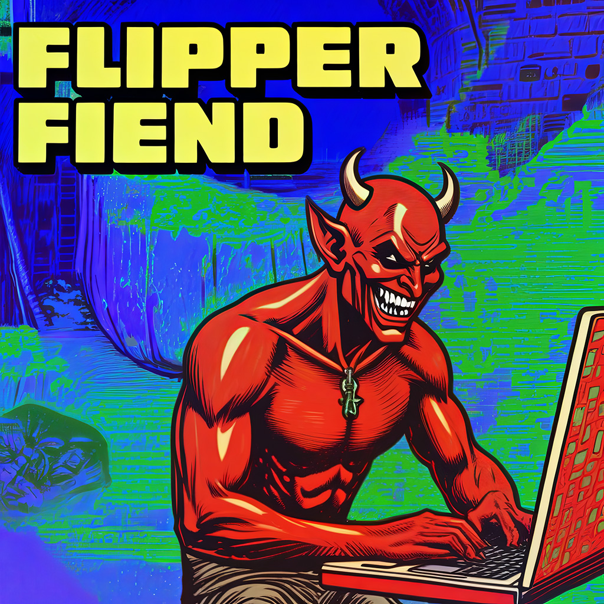
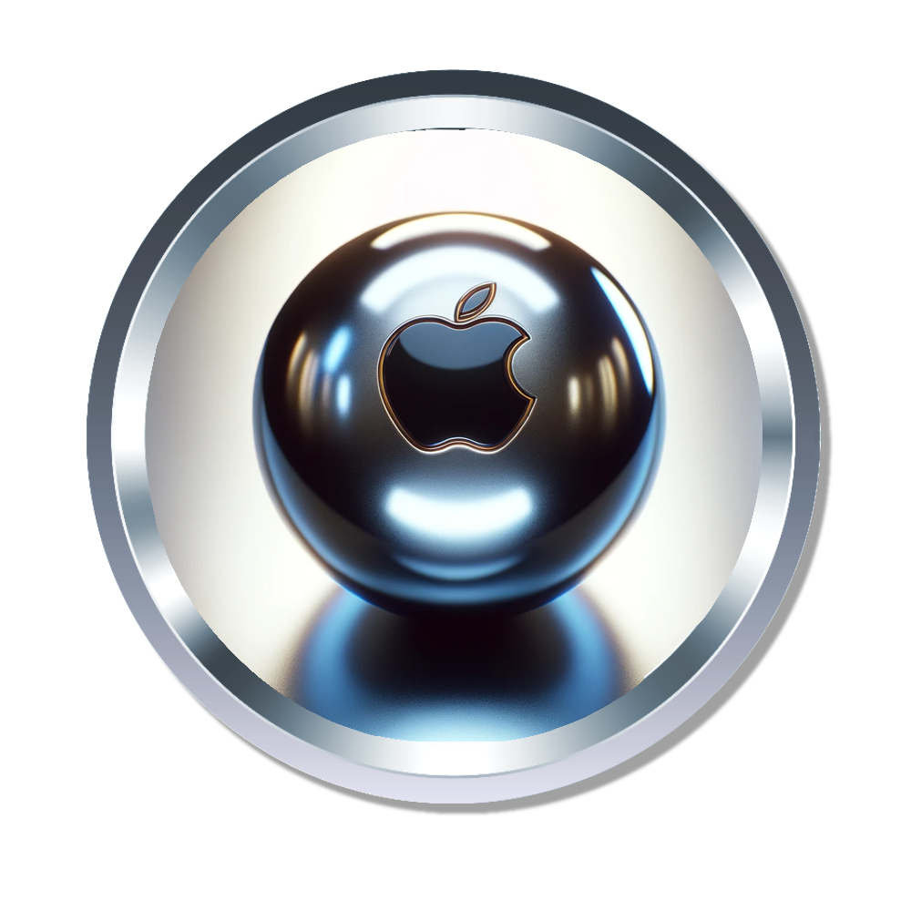

<h1>FlipperFiend</h1>

<h4><em>“It shouldn’t matter what OS you use if you just want to play some pinball.”</em></h4>

<h4>IMPORTANT: Flipper Fiend (FF) is currently alpha software. You'll need some familiarity with Python to run the alpha.</h4>

<h3> Quick Links:</h3>
<h4><a href="./Installation.md">Installation instructions</a>
<a href="./status.md">Status page</a> has details at the moment. I'll remove this message when things are more user-ready for beta testing.</h4>

<h3>What is it?</h3>

There are some great Visual Pinball front end options today for Windows and Linux users, but the best thing I’ve found for Mac is <a href="https://github.com/francisdb/vpxtool">Vpxtool</a>, and it’s text based. FlipperFiend will be a Mac-first front end and table manager that can also run on Linux and Windows.

<h3>If it’s cross platform, why Mac-first?</h3>

You have to start somewhere, and my Mac is where I do most of my development work. Mac is where the need is greatest, and it opens up the community to a whole bunch of users who don’t own Windows PCs. 

<h3>Key design features for MVP release:</h3>

<ul>
	<li>Python/QT code base.</li>
	<li>Launcher interface with library view and wheel image support.</li>
	<li>Index directory of VPX tables and link metadata from <a href="https://virtual-pinball-spreadsheet.web.app" title="the Virtual Pinball spreadsheet">the Virtual Pinball spreadsheet</a>.</li>
	<li>Edit individual table settings and data
		<li>Add wheel images</li>
		<li>Enable/disable in library view</li>
		<li>Favorite (for library filter)</li>
		</ul></li>
	<li>Preferences for location of VPX app, table directory, wheel images, etc</li>
</ul>

<h3>Items under consideration for future roadmap</h3>

<ul>
	<li>All-in-one installer a la Baller, but for Mac.
	<ul>
		<li>(possibly TMI:) VPX package for Mac is kind of like a native app and kind of not like one. Paths like ‘/.vpinball and~/.pinmame’ aren’t visible in Finder by default. There isn’t comprehensive documentation for Mac users today. In the short term I want to give users info and resources to get VPX running on their Mac. An all-in-one installer is probably the easiest way to improve the UX.</li>
		</ul></li>
	<li>Some representation of what each table looks like (screenshot, video, something)</li>
	<li>B2S solution. Imagine three screens with your Mac, an iPad, and an iPhone as a portable cab. Imagine docking your MacBook into a proper cabinet build. There’s a project for a <a href="https://github.com/jsm174/vpxds">Linux B2s server</a> that might run on MacOS or serve as a starting point.</li>
</ul>

<h3>Contributing</h3>

I’d welcome contributors or collaborators on the project. This is currently a one man spare time endeavor, and the roadmap is pretty ambitious. If you’d like to build a future where Macs are a first class VPX platform, here’s how you can help:

<ul>
	<li>User stories - the roadmap is based on mine, but ideas are good. You may do things with Mac VPX that I haven’t thought of. If you’re running VXP on Mac, what are your pain points? What would make it a better experience for you? The Issues tab is a good place for these conversations.</li>
	<li>Pull requests - I’m open to contributions within the design parameters of the project. Good = “here’s a better edit table interface.” Bad = “I refactored to C#/Rust/Cobol/Pascal.” If you’re proposing architectural or design changes, let’s discuss in an Issue before you write hundreds of lines of code.</li>
	<li>Documentation and how-to’s - The forums are great, there’s info out there today, but it’s scattered and can be hard to find. Let’s build a knowledge base that’s focused on the stuff that isn’t Windows.</li>
	<li>Evangelists and fellow proselytizers - Visual Pinball has been around for a very long time, but the Mac version is a very new thing. There are lots of people who own Macs and like pinball who don’t know about VPX standalone builds. </li>
</ul>

<h3>Ethos and Values</h3>

This is an open source project and free for noncommercial use (I’m still considering the license, but I’m leaning GPL). We want to grow the community of alt-OS VPX users (especially Mac users) and contributors. We’re able to play Visual Pinball thanks to many people contributing countless hours developing tables to play and the software to play them with. The tables and software don’t cost a dime. This is an opportunity to give something back.

There’s a valid argument that releasing open source software is a political act. In spite of that, political discussions tend to be a blocker for software delivery, and are extremely off topic.

Rapacious grifters: you’re setting your sights pretty low in life if your grift involves selling non-commercial pinball software to people who don’t know any better. I’m committed to ensuring the juice is not worth the squeeze for any aspiring bunco artists. 

It’s good to be a fiend, but don’t be an ass.

 
<i>Made on the Mac where I play Medusa.</i>

